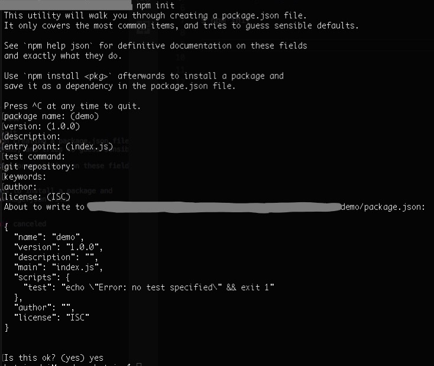
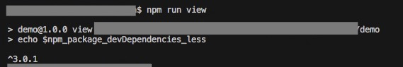
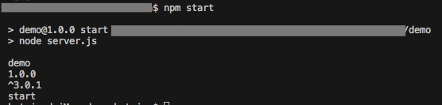

# package.json

每个项目的根目录下，一般有个 package.json 文件，用来管理本地安装的 npm 包。它定义了这个项目所需要的各种模块，以及项目的配置信息（比如名称、版本、许可证等元数据）。它必须是一个 json ，而不仅仅是一个 JavaScript 对象文字。

<br>

------

<br>


## 一、创建 package.json

### 案例1

新建文件夹 demo

在根目录执行 npm init 后会弹出一堆问题，可以输入对应内容，也可使用默认值。最后输入 yes 回车，就可以生成 package.json 文件



也可以执行 npm init --yes ，直接跳过设置的步骤，生成默认配置的 package.json

内容如下

<font color="deeppink">demo/package.json</font>
```json
{
  "name": "demo",
  "version": "1.0.0",
  "description": "",
  "main": "index.js",
  "scripts": {
    "test": "echo \"Error: no test specified\" && exit 1"
  },
  "author": "",
  "license": "ISC"
}
```

当然你也可以直接在根目录下，手动创建 package.json。

下面介绍 package.json 的字段。


<br>

------

<br>


## 二、package.json 内容

### 1、name
就是 npm 包名。name 和 version 是必须的字段，如果没有这两个字段，将无法被安装。

规则：
- 全部小写，不能包含大写字母，可以使用下划线、横线、@等
- 不能以点或者下划线开头，不能含有非URL安全的字符，不要使用已存在的 name 命名
- 长度必须小于等于214个字符


### 2、version

版本号

规则：
- x.x.x 的格式
- 符合“语义化版本规则”


### 3、description

描述信息，是一个字符串。有助于在使用 npm search 时找到这个包。


### 4、keywords

关键字，是一个字符串的数组。有助于在使用 npm search 时找到这个包。


### 5、bugs

项目问题反馈的 url 或 email 配置

```json
"bugs": { 
  "url" : "https://github.com/owner/project/issues",
  "email" : "project@hostname.com"
}
```

### 6、作者和贡献者信息

author 是一个人，contributors 是一些人的数组。person 是一个对象，拥有必须的 name 字段和可选的 url 和 email 字段，例如

```json
{
  "name": "Barney Rubble",
  "email": "b@rubble.com",
  "url": "http://barnyrubble.tumblr.com/"
}
```

或者你也可以使用单个字符串的精简形式，npm会帮你解析它：

```js
"Barney Rubble <b@rubble.com> (http://barnyrubble.tumblr.com/)"
```


### 7、license

项目许可证，让使用者知道是如何被允许使用此项目。默认是”ISC”

[具体参考戳这里](https://docs.npmjs.com/files/package.json#license)


### 8、repository

项目代码存放地方
```json
"repository": { 
  "type": "git",
  "url": "https://github.com/npm/npm.git"
} 
```


### 9、homepage

项目主页的网址


### 10、main

指定了加载的入口文件，默认值是模块根目录下面的index.js。

案例1 里，项目名是 demo，那么 require('demo') 将返回 index.js 返回的内容


### 11、scripts

声明一系列npm脚本指令


### 12、config

对象，配置项目中需要的配置参数


### 13、dependencies

项目在生产环境中依赖的包

```json
"dependencies": {
  "webpack": "~3.8.1",
}
```

下面以 webpack 为例说明

| 版本号写法   | 安装依赖的版本            |
| --------------------------- |:--------------:|
| "webpack": "3.8.1"          | 等于3.8.1    |
| "webpack": ">3.8.1"         | 大于3.8.1    |
| "webpack": ">=3.8.1"        | 大于等于3.8.1   |
| "webpack": "<3.8.1"         | 小于3.8.1    |
| "webpack": "<=3.8.1"        | 小于等于3.8.1   |
| "webpack": "3.8.x"          | 会安装 3.8.0、3.8.1 等，不会安装 3.9.0  |
| "webpack": "~3.8.1"         | 3.8.x，不会安装3.9.x或者3.7.x   |
| "webpack": "^3.8.1"         | 3.x.x，不会安装4.x.x或者2.x.x   |
| "webpack": "3.8.1 - 4.0.0"  | >= 3.8.1 <= 4.0.0 |
| "webpack": "http://123.com" | 参考下面的URL作为依赖项 |

### 14、devDependencies

项目在开发和测试环境中依赖的包


### 15、files

一个被项目包含的文件名数组，如果你在里面放一个文件夹名，那么这个文件夹中的所有文件都会被包含进项目中(除非是那些在其他规则中被忽略的文件)。

你还可以在包的根目录或子目录下提供一个".npmignore"文件来忽略项目包含文件，即使这些文件被包含在files字段中。.npmignore文件和.gitignore的功能很像。


### 16、其他更多

- [更多参考1](https://docs.npmjs.com/files/package.json)
- [更多参考2](https://www.cnblogs.com/nullcc/p/5829218.html)
- [更多参考3](https://www.cnblogs.com/tzyy/p/5193811.html)

<br>

------

<br>


## 三、package scripts

npm 允许在 package.json 文件里面，使用 scripts 字段定义脚本命令。scripts 字段是一个对象，它的每一个属性，对应一段脚本。这些脚本，称为 npm 脚本。

使用 npm run 查看项目所有的脚本命令；使用 npm run xxx 可以执行对应的命令。

例如
```json
"scripts": {
  "build": "webpack -p"
}
```

npm run build , 就等同于执行了 webpack -p
 
优点：
  - 项目的相关脚本，可以集中在一个地方。
  - 不同项目的脚本命令，只要功能相同，就可以有同样的对外接口。用户不需要知道怎么测试你的项目，只要运行npm run test即可。
  - 可以利用 npm 提供的很多辅助功能。

使用 npm run 的方便之处在于，会自动新建一个 Shell，在这个 Shell 里面执行指定的脚本命令（将当前目录的node_modules/.bin子目录加入PATH变量，执行结束后，再将PATH变量恢复原样）。

这样你可以直接运行依赖和开发依赖程序，不需要全局安装了，只要 npm 上的包提供命令行接口，你就可以直接使用它们。

只要是 Shell（一般是 Bash）可以运行的命令，就可以写在 npm 脚本里面。


### 案例2：解析 less 和打包压缩 js

项目目录如下
```
[demo]
  |-- src
    |-- index.js
    |-- index.less
  |-- package.json
```

编译less

npm install less --save-dev

压缩js

npm i uglify-js --D

<font color="deeppink">demo/src/index.js</font>
```js
function init() {
  document.body.innerHTML = '<div class="box"></div>';
  console.log('title');
};

init();
```

<font color="deeppink">demo/src/index.less</font>
```less
body {
  background: yellow;
  .box {
    height: 100px;
    width: 100px;
    background: lightcoral;
  }
}
```

<font color="deeppink">demo/package.json</font>
```json
{
  "name": "demo",
  "version": "1.0.0",
  "description": "",
  "main": "./src/index.js",
  "scripts": {
    "less": "lessc src/index.less dist/index.css",
    "uglifyjs": "mkdir -p dist && uglifyjs src/index.js -c -o dist/index.min.js"
  },
  "author": "",
  "license": "ISC",
  "devDependencies": {
    "less": "^3.0.1",
    "uglify-js": "^3.3.21"
  }
}
```

[lessc 详解戳这里](http://lesscss.org/usage/#command-line-usage-server-side-and-command-line-usage)

[uglifyjs 详解戳这里](https://segmentfault.com/a/1190000008995453)

运行 npm run less , 将 demo/src/index.less 编译好后放到 demo/dist/index.css

运行 npm run uglifyjs , 先执行 mkdir -p dist , 新建文件夹 demo/dist ；再执行 uglifyjs src/index.js -c -o dist/index.min.js，将 src/index.js 打包，输出到 dist 文件夹下，打包后的文件名为 index.min.js

最终生成文件如下
```
[demo]
  |-- dist
    |-- index.css
    |-- index.min.js
```


1. 执行顺序
  运行 npm run uglifyjs , 执行的是多个任务，那就需要明确他们的执行顺序。如果是同时执行，使用 & 符号；如果是前一个执行完才能执行下一个，则用 && 符号。

2. 默认值
  npm 对两个脚本提供了默认值，这两个脚本不需要定义就可以直接使用，当然前提是项目根目录下有 server.js 、binding.gyp 文件才可以
    ```js
    "start": "node server.js"，
    "install": "node-gyp rebuild"
    ```

3. 简写形式
  npm start 是 npm run start
  npm stop 是 npm run stop的简写
  npm test 是 npm run test的简写
  npm restart 是 npm run stop && npm run restart && npm run start 的简写

先运行一次 npm run uglifyjs , 再运行 npm run less , 会比较麻烦，可以将其写到一起，如下所示

```json
"scripts": {
  "less": "lessc src/index.less dist/index.css",
  "uglifyjs": "mkdir -p dist && uglifyjs src/index.js -c -o dist/index.min.js",
  "dev": "npm run uglifyjs && npm run less"
},
```
运行 npm run dev , 相当于先执行了 npm run uglifyjs , 然后再执行 npm run less


### 案例3：钩子

npm 脚本有 pre 和 post 两个钩子

<font color="deeppink">demo/package.json</font>
```js
{
  "name": "demo",
  "version": "1.0.0",
  "description": "",
  "main": "./src/index.js",
  "scripts": {
    "preuglifyjs": "mkdir -p dist",
    "uglifyjs": "uglifyjs src/index.js -c -o dist/index.min.js",
    "postuglifyjs": "lessc src/index.less dist/index.css"
  },
  "author": "",
  "license": "ISC",
  "devDependencies": {
    "less": "^3.0.1",
    "uglify-js": "^3.3.21"
  }
}
```

当执行 npm run uglifyjs 时，就会按照下面顺序执行
```
npm run preuglifyjs && npm run uglifyjs && npm run postuglifyjs
```

npm 默认提供下面这些钩子
```
prepublish，postpublish
preinstall，postinstall
preuninstall，postuninstall
preversion，postversion
pretest，posttest
prestop，poststop
prestart，poststart
prerestart，postrestart
```

### 案例4：变量

npm 的内部变量的特征 以 npm_package_ 开头。例如 要获取 package.json 的 name，就是 npm_package_name , version 就是 npm_package_version

<font color="deeppink">demo/package.json</font>
```json
{
  "name": "demo",
  "version": "1.0.0",
  "description": "",
  "main": "./src/index.js",
  "scripts": {
    "less": "lessc src/index.less dist/index.css",
    "uglifyjs": "mkdir -p dist/$npm_package_name/$npm_package_version && uglifyjs src/index.js -c -o dist/$npm_package_name/$npm_package_version/index.min.js",
  },
  "author": "",
  "license": "ISC",
  "devDependencies": {
    "less": "^3.0.1",
    "uglify-js": "^3.3.21"
  }
}
```

这样运行 npm run uglifyjs 后，生成的文件如下
```
[demo]
  |-- demo
    |-- 1.0.0
      |-- index.min.js
```

npm run less 也可以类似修改
```
lessc src/index.less dist/$npm_package_name/$npm_package_version/index.css
```

注意，在 scripts 字段里使用 npm 内部变量时，前面要加 $ 符号

<font color="deeppink">demo/package.json</font>
```json
{
  "name": "demo",
  "version": "1.0.0",
  "description": "",
  "main": "./src/index.js",
  "scripts": {
    "less": "lessc src/index.less dist/$npm_package_name/$npm_package_version/index.css",
    "uglifyjs": "mkdir -p dist/$npm_package_name/$npm_package_version && uglifyjs src/index.js -c -o dist/$npm_package_name/$npm_package_version/index.min.js",
    "view": "echo $npm_package_devDependencies_less",
  },
  "author": "",
  "license": "ISC",
  "devDependencies": {
    "less": "^3.0.1",
    "uglify-js": "^3.3.21"
  },
}
```

[echo 命令参考戳这里](http://man.linuxde.net/echo)

运行 npm run view，查看 devDependencies 字段下的 less 版本号，效果如下



npm_package_scripts_less 变量的值等于
```
lessc src/index.less dist/$npm_package_name/$npm_package_version/index.css
```


新增文件
```
[demo]
  |-- server.js
```

<font color="deeppink">demo/server.js</font>
```js
console.log(process.env.npm_package_name)
console.log(process.env.npm_package_version)
console.log(process.env.npm_package_devDependencies_less)
console.log(process.env.npm_lifecycle_event)
```

运行 npm start ， 效果如下



npm 提供一个 npm_lifecycle_event 变量，返回当前正在运行的脚本名称

env 可以列出所有环境变量


